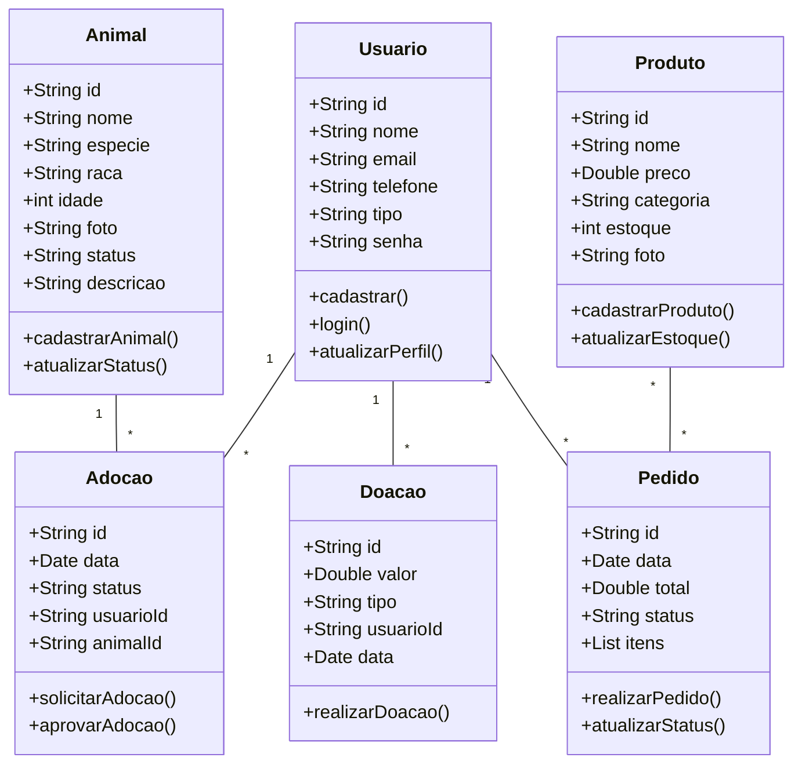
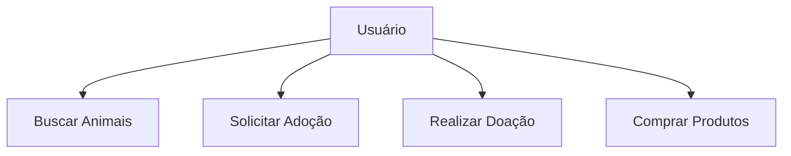
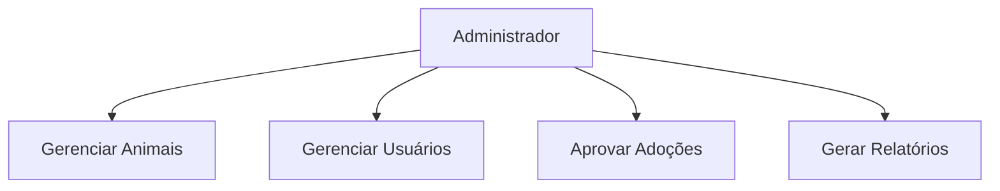
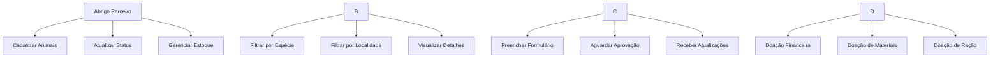
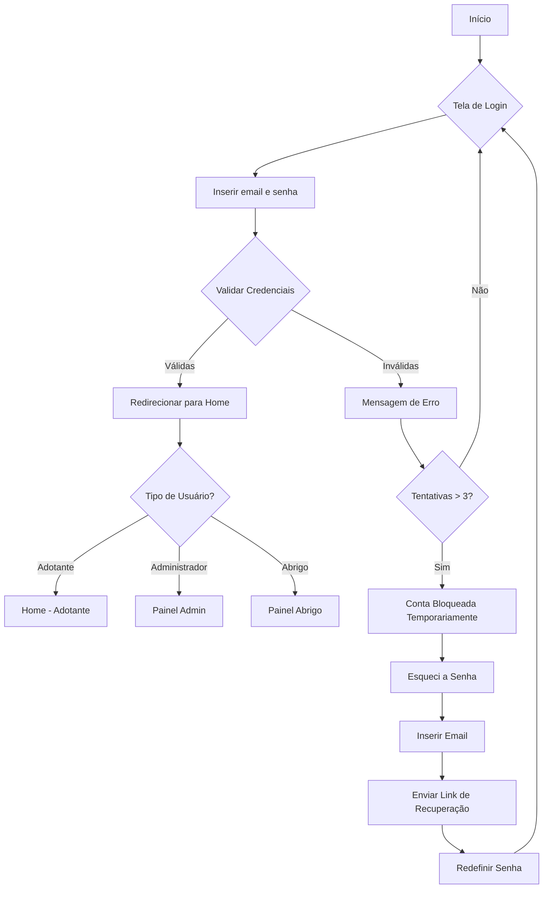
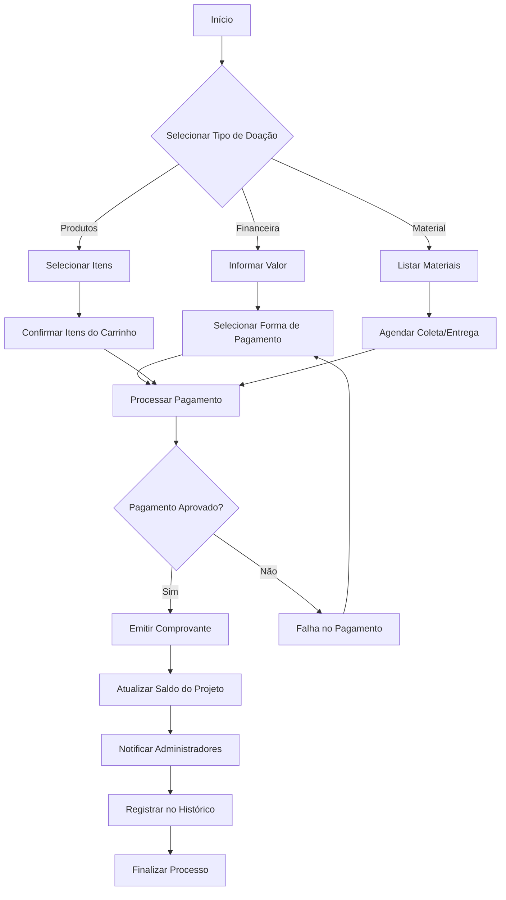

# HappyPet - Documentação
 Você sabia que o abandono de animais é considerado crime federal? Há 27 anos, mais precisamente desde 1998, existe uma lei que estabelece punição com pena de prisão e multa para quem abandona animais. Em 2020, uma nova lei substitutiva à anterior aumentou a pena de prisão para até cinco anos para crimes de maus-tratos contra cães e gatos.
 
 O Brasil ocupa a 4ª posição no ranking mundial de países com mais animais abandonados, com 177 mil cães em abrigos e aproximadamente 20 milhões vivendo nas ruas. Entre os gatos, a situação não é muito melhor: existem cerca de 10 milhões de felinos nas ruas e 7,4 mil em abrigos.

 Mas por que isso ainda acontece? As motivações para o abandono de animais são variadas, sendo a mudança de residência a principal razão, representando 9,2% dos casos. Outros motivos incluem a inabilidade de cuidar de um animal doente (7,6%), o nascimento de filhos (7,2%), o animal ter crescido mais do que o esperado (7,1%) e mudanças na rotina do tutor (6,4%).
 
 Quando compramos ou adotamos um animal, assumimos a responsabilidade por sua vida e bem-estar. Caso a pessoa não tenha mais condições de cuidar do animal, existem alternativas éticas, como procurar abrigos, organizações de resgate ou promover uma adoção responsável, em vez de simplesmente abandoná-lo.

 Nosso principal objetivo é ajudar animais de rua ao oferecer uma plataforma que conecta esses pets necessitados com pessoas que desejam adotar. Além disso, o sistema permitirá a venda de produtos e acessórios para pets e o recebimento de doações em dinheiro e de animais, com 100% da arrecadação revertida diretamente para o projeto, garantindo o suporte e bem-estar dos animais. Ele auxiliará a equipe de desenvolvimento no planejamento, implementação e testes, garantindo que as funcionalidades, interfaces e o comportamento esperado do sistema estejam perfeitamente alinhados com as necessidades dos usuários e os objetivos de nosso projeto. 

## Objetivos
 - Desenvolver uma plataforma mobile que conecte animais em situação de vunerabilidade com potencias adotantes, promovendo a adoação responsável e o combate ao abandono animal.

## Levantamentos de Requisitos
 - funcionais
  • Cadastro de usuários (adotantes e doadores)
  • Cadastro de animais
  • Sistema de busca e filtros para adoção
  • Processo de solicitação de adoção
  • Plataforma de produtos pet
  • Sistema de adoção online
  • Gestão de abrigo

 - Não funcionais
  • Intaface Responsiva
  • Tempo de resposta
  • Segurança de dados
  • Integração de pagamento

## Diagramas

1. ### Diagrama de Classe
 Diagrama de que demonstra as entidades da aplicação

   - usuário (user) : 

     - email
     - senha
     - id
     - create()
     - login()
     - logout()

   - Animais : 
     - id
     - nome
     - especie
     - idade
     - foto
     - status

    - Produto : 

     - id
     - nome
     - preco
     - categoria
     - estoque
     - foto

2. ### Diagrama de Uso
 - Atores Principais:
    - Adotante
    - Doador
    - Administrador
    - Abrigo Parceiro

 - Casos de Uso:
    - Cadastrar animal para adoção
    - Buscar animais disponíveis
    - Solicitar adoção
    - Realizar doação
    - Comprar produtos
    - Gerenciar usuários
    - Gerar relatórios
    - Aprovar adoções

   
   
    
   

3. ### Diagrama de Fluxo
Determian o Caminho que um ator percorre para realizar uma ação

- Ação de Login

- Ação do Processo de Doação

## Prototipagem
 - https://www.figma.com/design/9C1fdW1KD3w1ctKIe24yD6/HappyPet?node-id=0-1&p=f&t=LjKblXiC7HCE4IMG-0

## Codificação
